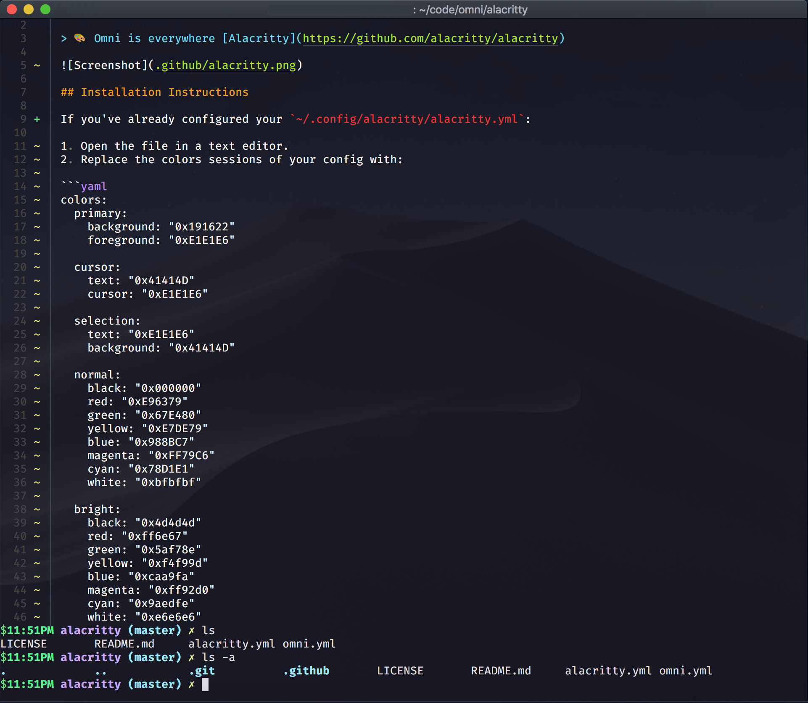

# Omni for [Alacritty](https://github.com/alacritty/alacritty)

> 🎨 Omni is everywhere [Alacritty](https://github.com/alacritty/alacritty)

## Installation Instructions

You just have to replace the colors section in `~/.config/alacritty/alacritty.yml` with this.
